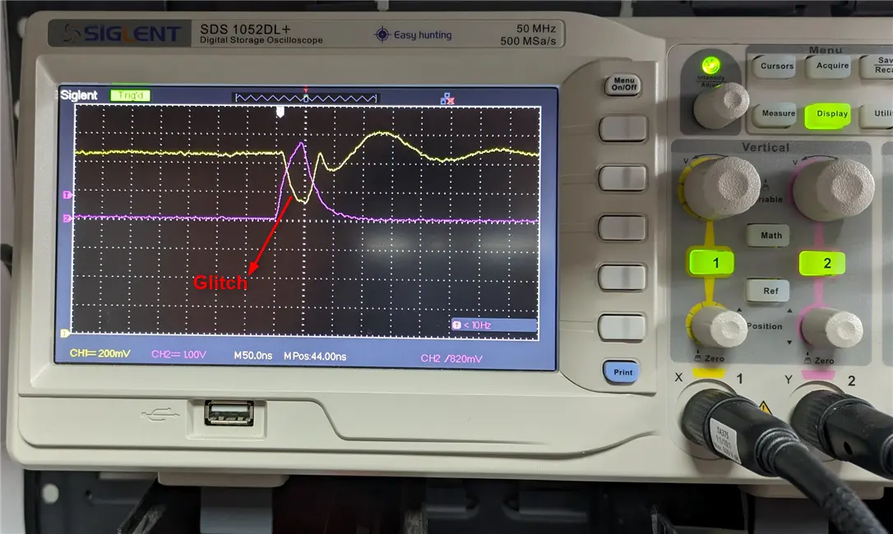

## Overview1
This blog describes voltage glitching attack on **STM32F4** series MCU. This post aims to provide a practical example of executing a voltage glitching attack, while also discussing the challenges and limitations one might encounter during the process.

## Introduction to Voltage Glitching

Fault Injection attack involves the process of deliberately introducing controlled/targeted faults into a system, such that the system misbehaves, but not enough to cause a hard fault.
`Voltage glitching` involves targeting the power supply of the system. The goal here is to manipulate the power to a target system precisely at a specific moment for specific period of time, such that the target system misbehaves such as skipping instructions, breaking memory and register contents etc.

```
From a security perspective this can be exploited to bypass security mechanisms such as secure debug access, 
access to protected memory, extracting secret keys, authentication bypass.
```


## Target Description

### STM32F4 series
The [STM32F4](https://www.st.com/en/microcontrollers-microprocessors/stm32f4-series.html) series microcontrollers (MCUs) are a popular family of embedded systems processors developed by STMicroelectronics. Renowned for their high performance, low power consumption, and rich peripheral integration, STM32F4 MCUs are widely used in a diverse range of applications, including industrial automation, consumer electronics, automotive systems, and IoT devices.

The target device used for this research was an [STM32F401CCU6 Minimum System STM32 ARM Core Board](https://robu.in/product/stm32f401ccu6-minimum-system-board-microcomputer-stm32-arm-core-board/), which contains an STM32F4 series MCU. The target details are mentioned below:
> 
Model: STM32F401CCU6.  
Core: ARM 32 Cortex-M4 CPU.  
Debug mode: SWD.  
84MHz work frequency.  
256K flash memory, 64K SRAM.  


## Technical Details STM32
### Boot Process and Boot ROM
Boot ROMs are the initial piece of code within microcontrollers that are executed during the boot process. These ROMs contain firmware code responsible for initializing essential hardware parameters and settings, such as memory configuration, security configuration (Option bytes) and boot modes, upon powering up the microcontroller. 

BOOT ROMs play a crucial role in the initial bootstrapping process of the microcontroller, ensuring proper initialization before handing control over to the main application code. They are integral to the startup sequence of the microcontroller and help establish a stable and functional operating environment for the device.  


The bootloader is stored in the internal boot ROM (system memory) of STM32 devices, and is programmed by ST during production. Its main task is to reprogram the Flash memory through one of the available serial peripherals. More details on the STM32 Bootloader can be found in [AN2606:Application Note](https://www.st.com/resource/en/application_note/cd00167594-stm32-microcontroller-system-memory-boot-mode-stmicroelectronics.pdf)


### Enabling Bootloader 

STM32F4 has a set of dedicated I/0 pins knowns as Boot Pins, these pins are used to determine the boot options. The BootROM present in STM32 Microcontrollers checks for a predefined logic level in the Boot Pins and then enables the bootloader. In STM32F4 the bootloader can be activated by setting a specific pattern on the Boot Pins, as mentioned in this [document](https://www.st.com/resource/en/application_note/cd00167594-stm32-microcontroller-system-memory-boot-mode-stmicroelectronics.pdf)  .


### STM32 Bootloader Features
The STM32 Bootloader supports USART protocol and provides a lot of features. This bootloader supports a wide set of commands as described in the [application note](https://www.st.com/resource/en/application_note/cd00264342-usart-protocol-used-in-the-stm32-bootloader-stmicroelectronics.pdf).
<figure style="text-align:center;">

<figcaption>STM32 Bootloader commands </figcaption>
</figure>


We are interested in the Read Memory Command as it helps us to dump the flash memory contents of the MCU. The key takeaway is that the Read command has a limit—it only fetches 256 bytes of memory, starting from a specific memory address location.

## STM32 Security Overview

STM32 MCUs provide a host of security features which has been described [here](https://www.st.com/resource/en/application_note/an5156-introduction-to-security-for-stm32-mcus-stmicroelectronics.pdf). STM32 MCUs also provide a security mechanism called `Read Out Protection (RDP)` to prevent unauthenticated access to flash memory contents. STM32 provides a specific set of Option Bytes to configure the security setting of the MCU. Option Bytes are mostly used to pre-configure the system on chip before starting the Cortex®-M and user code. They are basically meant to allow the user a way to customize the general settings of the microcontroller.

STM32F4 basically provides three levels of [Read Out Protection](https://www.st.com/resource/en/application_note/dm00186528-proprietary-code-readout-protection-on-microcontrollers-of-the-stm32f4-series-stmicroelectronics.pdf) :

<figure style="text-align:center;">

<figcaption>STM32 RDP Levels </figcaption>
</figure>


RDP0
> This is the Default level. In this mode there is no protection.

RDP1
> In RDP Level 1 there is no access to Flash Memory. Reading, programming and erasing the flash memory, even through SWD or JTAG is also disabled. Any read request to the protected Flash memory generates a bus error. In this level booting from SRAM and system bootloader is allowed.

RPD2 
> In this level, the chip is fully protected. All the option bytes are frozen and cannot be modified. The JTAG, SWV (single-wire viewer), ETM, and boundary scan are disabled. Booting from SRAM or from system memory bootloader is not allowed.


RDP Levels can always be levelled up. Downgrading from RDP1 to RDP0 can be done by reprogramming the option bytes, but this would lead to a mass erase of flash memory, SRAM and backup registers.  RDP2 level is irreversible and cannot be downgraded.


## STM32 Power Management/Regulation

For `Voltage Glitching` attack, we need to target the power supply of the MCU. Every MCU has a specifically designed power management/ regulation system, which is used for powering the internal circuitry, peripherals etc. The power supply scheme of STM32 is shown in the below figure.
<figure style="text-align:center;">

<figcaption>STM32F4  Power Supply Scheme </figcaption>
</figure>

From the power supply scheme it is clear that we need to target the voltage regulator to inject faults into the power rails. VCAP_1 and VCAP_2 gives us direct access to internal power rails. 

## Glitch Setup

As mentioned earlier, we have used [STM32F401CCU6 Minimum System STM32 ARM Core Board](https://robu.in/product/stm32f401ccu6-minimum-system-board-microcomputer-stm32-arm-core-board/) for this research.

### Hardware Setup


Every system has components designed to specifically maintain the its operating voltage at the appropriate levels, such as decoupling capacitors. One of the challenges/requirement with this method is to modify/tamper  the hardware circuitry in order to overcome the protection offered by these components. This includes removal of some components, replacing with custom components, as well as selecting the glitch injection point.

We have used VCAP_1 as glitch injection point. The decoupling capacitors were replaced, which would increase the impact  of our glitch on the target. A custom glitch injection circuit consisting of capacitors, resistors and MOSFETs was created to ensure precise glitch injection. Each component was carefully chosen following comprehensive research to ensure the circuit delivers the desired glitch reliably.

We used `Teensy` board to develop our glitcher software, which would help us to control the glitch and precisely inject the required glitch.   
We tested out other glitching tools such as `Chipwhisperer Lite`, but hit a snag with the STM32 bootloader's UART protocol, which demands an even parity bit. It was a tough nut to crack because Chipwhisperer Lite's didn't offer a straightforward way to tweak the UART parity bit.  

We came across a fix for this issue in a recent [article](https://sec-consult.com/blog/detail/secglitcher-part-1-reproducible-voltage-glitching-on-stm32-microcontrollers/), but we were already underway with our research when it was released, and had already started a different approach at that time.


The hardware setup used for the research is shown in the figure below.
<figure style="text-align:center;">

<figcaption>Hardware Setup </figcaption>
</figure>

Teensy board is communicating serially to the targets UART port. It also controls the glitch injection circuit, to inject the glitch precisely. We soldered the output of glitch injection circuit to VCAP_1, ensuring minimal losses to the glitch. The specified logic levels are applied on the Boot Pins so that the target boots into the bootloader mode as mentioned in the section [Enabling Bootloader](#enabling-bootloader). 

### Software Setup

ST-Link V2 Programmer was used to connect to the target via the SWD interface. We used STM32Cube IDE to write a sample program and flashed it to the target. A dump of the flash memory was taken to verify our results later on, a snapshot of the dump is shown below.
<figure style="text-align:center;">

<figcaption>Firmware dump before enabling RDP1</figcaption>
</figure>

 Next, STM32CubeProgrammer was used to enable RDP1 on the target. STM32CubeProgrammer enables us to program the Option Bytes in STM32 MCUs. RDP1 can be enabled by setting any value other than 0xAA and 0xCC.  

<figure style="text-align:center;">

<figcaption>RDP1 enabled on target </figcaption>
</figure>

### Glitcher Software
Our aim is to dump the software, as mentioned [earlier](#stm32-bootloader-features) we will be targeting the Read Memory command(0x11). As described [here]((https://www.st.com/resource/en/application_note/cd00264342-usart-protocol-used-in-the-stm32-bootloader-stmicroelectronics.pdf)), on receiving the Read Memory command, the device checks if any RDP levels is set or not and based on that access to flash memory is provided. If RDP is active the device returns NACK byte for the Read Memory command else the device returns ACK byte.

The glitcher software performs the following operation 
```python 
send_read_memory_command()
inject_glitch(glitch_parameters)
result= read_response()
if result == ack:
  # RDP1 Bypassed
  data = read_265K_from(address)
  # memory read successful
  print(data)
elif result == nack:
  #Print RDP1 active
  send_read_memory_command()
```

## Glitching the target

Once the hardware and software is setup, we ran the setup for obtaining initial characterization. Obtain the glitch parameters from the characterization tests done. Observe the glitch on an oscilloscope to corelate the software glitch parameters with the actual glitch impact. Narrow down the glitch parameters after each run based on the characterization results obtained.

<figure style="text-align:center;">

<figcaption>Observing Trigger and Glitch Parameters  </figcaption>
</figure>
 
#### Note
During the process of narrowing down the glitch parameters, we observed that positive ack response for Read Memory command is obtained, but on comparing the data, we only got zeros as data as shown below. This meant that RDP1 level was successfully bypassed but we were not able to read the data. 

<video class="center" width="80%" autoplay loop muted >
  <source src="./assets/gifs/Pcrop.webm" type="video/webm" />
</video>

Upon further analysis, it became apparent that the Option Byte for PCROP (SPRMOD) was inadvertently getting set during the voltage glitching process. This suggests the need to fine-tune the glitch to prevent unintended setting of PCROP during glitching.
<figure style="text-align:center;">

<figcaption>PCROP Bit getting set during glitching </figcaption>
</figure>
  


We manually unset the PCROP bit , regressed the RDP level to RDP0 , then followed the whole software setup and restarted the whole process.
 

## Glitched Successfully  

After fine tuning the glitch, finally the glitch was successful and we obtained some data as shown [below](#mem). To verify our results, we compared the data output with the original dump taken before enabling RDP1 as shown in [figure](#dump).

<figure style="text-align:center;">

<figcaption>Successful Data Read</figcaption>
</figure>


As explained in the above [section](#stm32-bootloader-features), a single Read Memory Command can only read 256 bytes of data before reading the next block of data. Since the targets flash size is of 256KB, a total of 1024 successful glitches were required to extract the whole flash memory. The glitch setup was kept running till the whole firmware was extracted.

<video class="center" width="80%" autoplay loop muted >
  <source src="./assets/gifs/memory_read_1.webm" type="video/webm" />
</video>


After around **`22hrs`** and 1024 successful glitches out of 621594 glitches, the whole firmware was extracted as shown in [figure](#full_mem) below.
<figure style="text-align:center;">

<figcaption>Extracted 256KB Flash Memory</figcaption>
</figure>


* * *
<!-- ### Authors -->
### This research was carried out by [`Jerin Sunny`]({{site.author1_profile_link}}) and [`Shakir Zari`]({{site.author2_profile_link}}){:target="_blank"} and published on behalf of the [`FEV Secure Lab`](https://in.linkedin.com/company/fev-india){:target="_blank"}.

* * *
